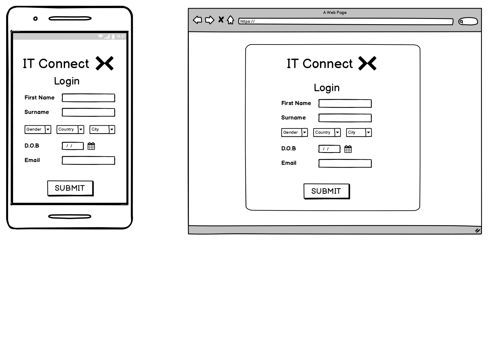
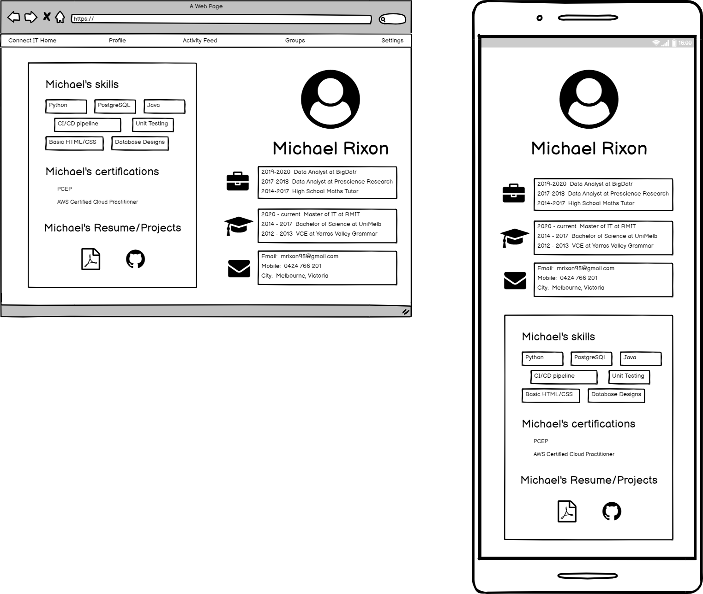
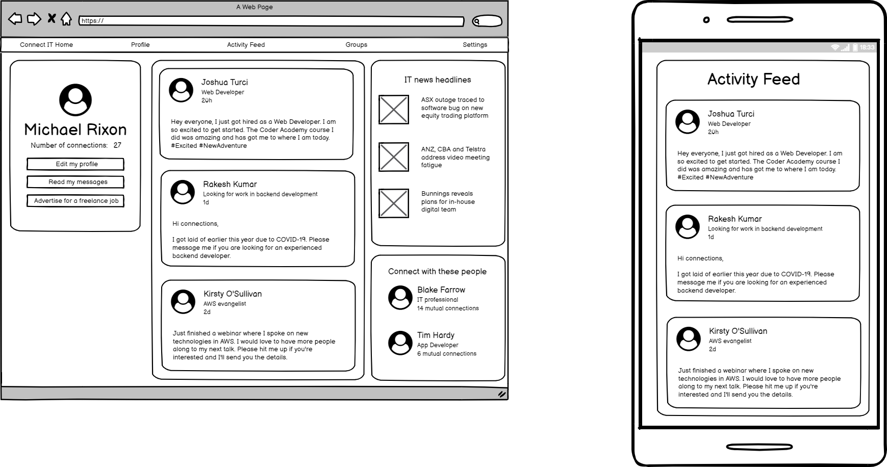
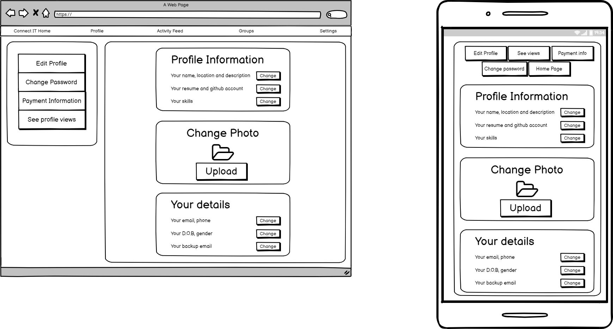
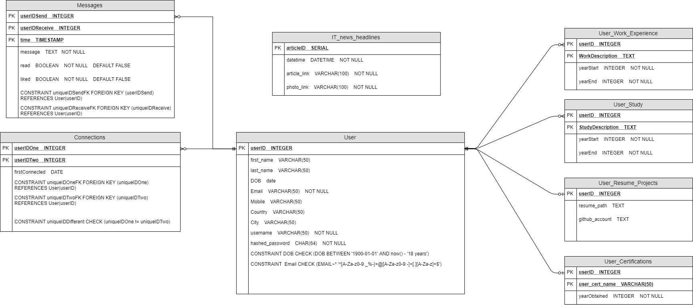

# Overview

My Trello board is [here](https://trello.com/b/7Y9qhmBJ/project-management)
My swagger editor yml is [here](https://github.com/mrixon95/Docs_On_Term3_CCC_course/blob/main/LinkedIn%20App/connectITAPI.yaml)

My app is designed to be a LinkedIn site for IT professionals.
Similar to LinkedIn, IT professionals will be able to:
* create an account
* make posts and add photos of themselves
* write a bio and add work experience
* connect, follow and message other users
* list their skills, experience, education and add a link to their github account
* like and comment on other posts

Different from LinkedIn as of November, 2020, IT professionals will be able to:
* freely advertise themselves for freelance IT work
* join groups with people who have similar interests

# Wireframes

### Login page

### Profile page

### Activity Feed page

### Settings page

### Entity Relationship diagram

