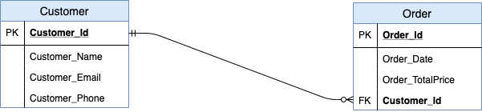
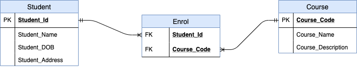

# Introduction (Database and DBMS)

Join the Coder Academy CCC team on Discord using https://discord/gg/qGUpN5K

## Difference between data and information

Data is unprocessed raw facts without conveying meaning.
Processed data which is now meaningful is information. It can be used for decision-making
eg. Student grade inputs are raw data. Processed data that becomes a meaningful transcript is information.

Database has data in it as well as metadata (data about the data)

## Relational databases

A relational database has tables where each table has multiple records and records in one table are related to records in another table.
eg. table for students, courses
table that relates students to courses through joint tables

Data in same column (field) have the same data type
Each column is a field and the row is a record/tuple.
Relations means tables and a relation is a collection of records.

To create and manage databases we have a DBMS (Database Management System). The DBMS serves as an interface between the user and the databases. A DBMS improves data sharing, data security and data integration. A DBMS allows you to create and manage databases.


A DBMS uses ACID concepts to maintain database health.
Atomicity: A transaction needs to be completely run and never partially. Its all or nothing.
Consistency: This means the Database is always in a correct state eg. We are not left in a mid-transaction state where one account fails to update after $20 withdrawn from one's account.
Isolation: Transactions running concurrently with eachother but don't cause errors so that it is like they are run concurrently.
Durability: Transactions are stored regardless of software or hardware failure

It is important to properly design your database.

## Database design tools

Tools for data modelling include:
https://www.smartdraw.com/entity-relationship-diagram/
https://www.microsoft.com/en-GB/microsoft-365/p/visio-standard-2019/cfq7ttc0k7cf?activetab=pivot:overviewtab
https://www.diagrameditor.com/

## Elements of a database design


Rectangle: Entity set (Student, Course)
Diamond: Relationship (Enrol)
Ellipses: Attributes (student_id, student_name, student_city, course_code, course_name)
- double: Multivalued attribute
- dashed: Derived attribute
Underline: Primary Key attribute (student_id)
Line: Is the link between entity sets and relationship or attributes

Multivalued attribute eg. country code in a phone number


The diagram has entities, attributes and relationships
A database is modelled using an Entity Relationship Diagram. This diagram shows entities and the relationships between them.
An entity is an object like a student, car, company, plant etc.
Entities have attributes which are descriptive properties for all members of the entity set eg. a student entity has attributes like name, address and DoB.
A relationship is an association among several entities. 

Primary key uniquely identifies a record.

The symbol next to the entity is the cardinality (the maximum number in the relationship) and the symbol closer to the relationship is the ordinality (the minimum number in the relationship)

Zero is represented by a small circle
One is represented by a small line 
Many is represented by the crow's foot notation

## Types of relationships:

### One to One:

One student has only one contact details record
A contact details record belongs to just one student

Little Straight Line represents one and only one. Looks like a one.


### One to Many:

One customer can make many orders
An order is made by one and only one customer


### Many to Many:

A student can enrol in many courses
A courses can have many students

Many to many relationships require a junction/joint table which has the primary key of each of the two entities
that are related to each other.
Primary keys are like an index for quickly retrieving records in your table.

Cardinality refers to the maximum number of relationships.
Ordinality refers to the minimum number of relationships.

Cardinality refers to the maximum number of times an instance in one entity can be associated with instances in the related entity. Modality refers to the minimum number of times an instance in one entity can be associated with an instance in the related entity.


Primary keys uniquely identify records.
PKs cannot be Null. To link tables with another you need a PK.

One to many relationship requires a foreign key

 


Many to many relationship requires a Junction/Join table

 


<!-- ## SSH into instance

1. Take note of public IP address for the created instance eg:ec2-54-88-60-6.compute-1.amazonaws.com or 54.88.60.6. If an elastic IP has not been set then these could change and need to be updated
2. Check the permissions of the key that was downloaded in the previous section step 10. Navigate to where the key was saved in your system then:
    ```
    :~/key$ ls -l
    total 8
    -rwx------ 1 colforst colforst 1700 Oct 27 13:17 aws_educate.pem
    -rwx------ 1 colforst colforst 1692 Oct 26 15:56 duck.pem
    :~/key$
    ```
    This checks the permissions of the key. Both keys here have permissions set for only the owner which is what we want. The command required to set these permissions for duck for example is:

    ```
    :~/key$ chmod 700 duck.pem
    ```
3. Now we can use this key to connect to our instance. You can either be in the folder that the key is in or type the absolute path. For example:

   This command can be used with the absolute path
    ```
    :~$ ssh -i /home/colforst/key/duck.pem ubuntu@54.88.60.6
    ```
    Or this command can be used if in the folder
    ```
    :~/key$ ssh -i duck.pem ubuntu@54.88.60.6
    ```
   Also note ubuntu is the user name of the instance we created

4. OPTIONAL ONLY - if we are always connecting to an instance we can set a config file to enable us to write a shortcut to connect. It is basically the steps as outlined previously but put into a script. 
   1. Go to your .ssh directory. The standard directory is in /home/username
   ```
   :~$ pwd
   /home/colforst
   :~$ ls -a
   .   .bash_history  .bashrc  .config     .ipython  .jupyter    .local       .mume     .psql_history  .python_history  .sudo_as_admin_successful  .vscode-server  .xsession         key
   ..  .bash_logout   .cache   .gitconfig  .john     .landscape  .motd_shown  .profile  .pylint.d      .ssh             .viminfo                   .wget-hsts      .xsession#enable
   ```
   I have used the ls -a command to show hidden files and we can see the .ssh file is in there.
   2. Create the config file in the .ssh folder
   ```
   :~$ cd .ssh
   :~/.ssh$ touch config
   ```
   3. Open the file usingL
   ```
   :~/.ssh$ vim config
   ```
   4. The edits are as follows.
   ```
   Host *
       PORT 22
   Host ec2db
       HostName 54.88.60.6
       User ubuntu
       IdentityFile /home/colforst/key/duck.pem
   ```
   The host ec2db was created by me and is now the shortcut to connect to the system. With this file in place I can now connect to the instance with:

   ```
   :~$ ssh ec2db
   ```
   as the command. You can enter more then one connection with the config file and also use it with keys stored in id_rsa.

## Install POSTGRES SQL on EC2 instance

1. SSH into the ec2 instance and install postgres.
   ```
   sudo apt update
   sudo apt-get install postgresql
   ```
2. Login into the postgres shell using:
   ```
   sudo -u postgres psql
   ```
3. Postgres sql is now running on the instance. However it has not been set up for remote queries or inputs from say a python script.

## Upddate POSTGRES SQL for access remotely using python scripts.

1. Log into postgres on the ec2 instance as outlined in step 2 of the previous section.
2. Type the following command and copy the path that is listed.
   ```
   SHOW config_file;
   ```
   The path listed comes out as:
   ```
    /etc/postgresql/12/main/postgresql.conf
   ```
3. Exit postgres sql and type the following in your command console to open this file to edit.
   ```
   sudo vim /etc/postgresql/12/main/postgresql.conf
   ```
   Go down the page until you find:
   ```
   #listen_addresses = 'localhost'
   ```
   Uncomment the line and change the above to
   ```
   listen_addresses = '*'
   ```
   Postgres sql will know be listening to all addresses. Save and exit vim
4. Type the following command and copy the path that is listed.
   ```
   SHOW hba_file;
   ```
   The path listed comes out as:
   ```
    /etc/postgresql/12/main/pg_hba.conf
   ```
5. Exit postgres sql and type the following in your command console to open this file to edit.
   ```
   sudo vim /etc/postgresql/12/main/pg_hba.conf
   ```
   Scroll down to the very bottom where the entries are as follows:
   ```
   # replication privilege.
   local   replication     all                                     peer
   host    replication     all             127.0.0.1/32            md5
   host    replication     all             ::1/128                 md5
   ```
   Create a new line and enter the following on the new line
   ```
   host    all             all             0.0.0.0/0               md5
   ```
   The table should now look like this:
   ```
   # replication privilege.
   local   replication     all                                     peer
   host    replication     all             127.0.0.1/32            md5
   host    replication     all             ::1/128                 md5

   host    all             all             0.0.0.0/0               md5
   ```
   Postgres sql will now also accept requests from all IP addresses. Save and exit vim.
6. Now that these changes have been made restart postgres sql:
   ```
   sudo service postgresql restart
   ```
7. Add a password to the user postgres. First log into postgres shell as per previous step
   ```
   ALTER ROLE postgres WITH PASSWORD 'postgres';
   ```
   In this example postgres has been used as the password
 -->
