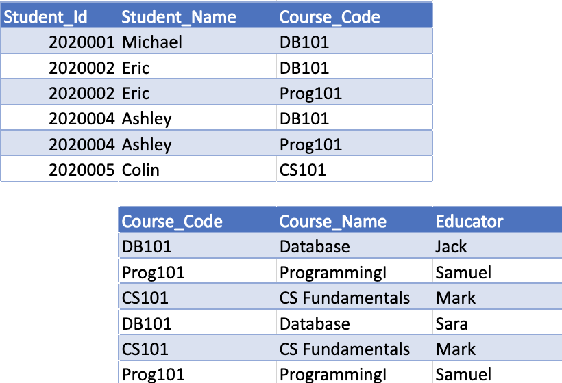

# Introduction (Database and DBMS)

Join the Coder Academy CCC team on Discord using https://discord/gg/qGUpN5K

## Difference between data and information

Data is unprocessed raw facts without conveying meaning.
Processed data which is now meaningful is information. It can be used for decision-making
eg. Student grade inputs are raw data. Processed data that becomes a meaningful transcript is information.

Database has data in it as well as metadata (data about the data)

## Relational databases

A relational database has tables where each table has multiple records and records in one table are related to records in another table.
eg. table for students, courses
table that relates students to courses through joint tables

Data in same column (field) have the same data type
Each column is a field and the row is a record/tuple.
Relations means tables and a relation is a collection of records.

To create and manage databases we have a DBMS (Database Management System). The DBMS serves as an interface between the user and the databases. A DBMS improves data sharing, data security and data integration. A DBMS allows you to create and manage databases.

A DBMS uses ACID concepts to maintain database health.
Atomicity: A transaction needs to be completely run and never partially. Its all or nothing.
Consistency: This means the Database is always in a correct state eg. We are not left in a mid-transaction state where one account fails to update after $20 withdrawn from one's account.
Isolation: Transactions running concurrently with eachother but don't cause errors so that it is like they are run concurrently.
Durability: Transactions are stored regardless of software or hardware failure

It is important to properly design your database.

## Database design tools

Tools for data modelling include:
https://www.smartdraw.com/entity-relationship-diagram/
https://www.microsoft.com/en-GB/microsoft-365/p/visio-standard-2019/cfq7ttc0k7cf?activetab=pivot:overviewtab
https://www.diagrameditor.com/

## Elements of a database design

Rectangle: Entity set (Student, Course)
Diamond: Relationship (Enrol)
Ellipses: Attributes (student_id, student_name, student_city, course_code, course_name)
- double: Multivalued attribute
- dashed: Derived attribute
Underline: Primary Key attribute (student_id)
Line: Is the link between entity sets and relationship or attributes

Multivalued attribute eg. country code in a phone number

The diagram has entities, attributes and relationships
A database is modelled using an Entity Relationship Diagram. This diagram shows entities and the relationships between them.
An entity is an object like a student, car, company, plant etc.
Entities have attributes which are descriptive properties for all members of the entity set eg. a student entity has attributes like name, address and DoB.
A relationship is an association among several entities. 

Primary key uniquely identifies a record.

The symbol next to the entity is the cardinality (the maximum number in the relationship) and the symbol closer to the relationship is the ordinality (the minimum number in the relationship)

Zero is represented by a small circle
One is represented by a small line 
Many is represented by the crow's foot notation

## Types of relationships:

### One to One:

One student has only one contact details record
A contact details record belongs to just one student

Little Straight Line represents one and only one. Looks like a one.

### One to Many:

One customer can make many orders
An order is made by one and only one customer

### Many to Many:

A student can enrol in many courses
A courses can have many students

Many to many relationships require a junction/joint table which has the primary key of each of the two entities
that are related to each other.
Primary keys are like an index for quickly retrieving records in your table.

Cardinality refers to the maximum number of relationships.
Ordinality refers to the minimum number of relationships.

Cardinality refers to the maximum number of times an instance in one entity can be associated with instances in the related entity. Modality refers to the minimum number of times an instance in one entity can be associated with an instance in the related entity.

Primary keys uniquely identify records.
PKs cannot be Null. To link tables with another you need a PK.

One to many relationship requires one table's PK to be a foreign key in another table

 

Many to many relationship requires a Junction/Join table. The joint table contains two foreign keys that are the primary keys of the tables in the relation

 

### Normalization

Normalization is about elimating unnecessary redundancy and duplication of data. Decompose one table into multiple tables to achieve the 3NF.

First Normal Form (1NF) Rules:
1. Column names must be unique. eg. can't have 2 columns called student_id 
2. Records in one column must be of same type. eg. can't have student_id of type text and type integer
3. Order of records does not matter.
4. Must have atomic values in columns eg. one value per field

 

 

Second Normal Form (2NF) Rules:
1. Table must be in 1NF
2. Must be no partial dependencies

 

 

The table has a composite key of Student_Id and Course_Code Course_name only depends on course_code and student_id only depends on student_name so there is a partial dependency. To satisfy 2NF we need to create a seperate course table. Now the composite key Student_Id and Course_code determines the Student_Name

Third Normal Form (3NF) Rules:
1. Table must be in 2NF.
2. Must be no Transitive Dependencies

 

 

 

 

 
