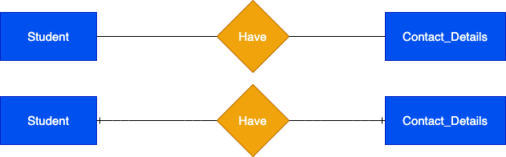
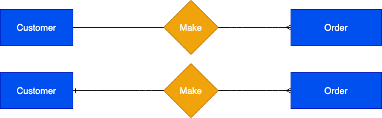
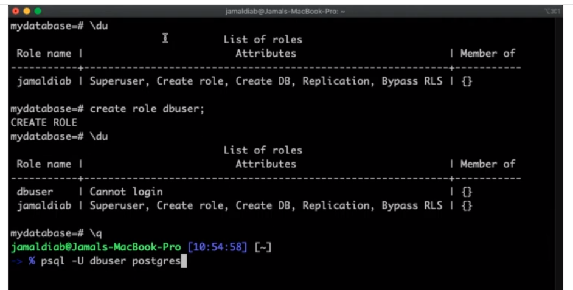

# Structured Query Language SQL

SQL is a language for defining, manipulating and controlling databases.


## Kahoot! Questions and Answers

Q1: A ___ is a collection of related reocrds or a collection of related tables
A1: Database

Q2: You can create/manage a single or multiuser database using a ____
A2: DBMS

Q3: A student, company, car, or plant are examples of ____.
A3: Entity

Q4: A name, address, and date of birth are examples of ____.
A4: Attributes

Q5: A 1-to-1, 1-to-Many, and Many-to-Many are examples of ____.
A5: Relationship

Q6: This ERD is ____.
A6: One-to-One
 

Q7: This ERD is ____.
A7: One-to-Many
 

Q8: This ERD is ____.
A8: Many-to-Many
 

Q9: What is Not True in this relationship?
A9: A student can have no course enrolments (Optional)

Q10: Which 1NF rule this table doesn't satisfy
A10: Must have atomic values in columns


## SQL Categories

1. DDL (Data Definition Language): Data definition commands are used to create a database, modify a database structure by creating, altering, or deleting objects in a database.

2. DML (Data Manipulation Language): Data manipulation commands are used to Insert data into a database table, update, or delete data.
3. DCL (Data Control Language): Data control include commands for securing a database by creating roles and assigining permissions.
DCL is all about security. Grant and revoke priviledges
4. TCL (Transactional Control Language): Transactional control used to manage database transactions such as saving or restoring transactions in a database.
Allows the rollback of transactions. Updates aren't in the database until commited.
5. DQL(Data Query Language): Data query mainly used for data retrieval.

SQL is a database language and like programming languages needs a system to run on. Many systems are available in the market such as Miscrosoft SQL, MYSQL, PostgreSQL, Oracle DB, DB2, and Microsoft Access. Some DBMSs are open-source free for individuals and businesses, other are not. The language is the same accross all DBMSs with a slight syntax changes. In this course, will use PostgreSQL which is a free open source database system. PostgreSQL supports major operating systems such as Windows, Linux, and MacOS.


## PSQL Utility

Postgres comes with a default role of postgres

### Launch psql utility or connect to sql server using :
```
    
	sudo apt-get --purge remove postgresql
	sudo apt-get -y install postgresql
	
	/* Connect to PostgreSQL using the postgres role */
	sudo -i -u postgres

	/* Access PostgreSQL using the psql */
	psql
   
```


```
/* See all users */
\du

/* List of databases */
\l

/* List relations in a database */
\l


/* See all users */
\du

/* Clear */
\! clear


/* Connect to a database*/
\c template1


/* List schemas */
\dn


/* List of commands in history */
\s


/* List all possible commands */
\h

```


```


/* Create database*/
/* Convention is to uppercase all the sql commands and lowercase for the names of the database*/
CREATE DATABASE mydatabase;

/* We are using a bunch of sql commands and utility commands. SQL commands end with semi-colon*/
/* Connect to the database we created*/
\c mydatabase

/* Create patient table */
CREATE TABLE patient(
	id integer,
	firstname VARCHAR,
	lastname VARCHAR,
	suburb VARCHAR
);

/* Create person table */
CREATE TABLE Person(
	ID integer,
	LastName VARCHAR,
	FirstName VARCHAR,
	Age INTEGER,
	City VARCHAR
);

/* View the structure of a particular table */
\d Person


/* Create role dbuser - by default it cannot login */
create role dbuser


 


/*


*/

```


