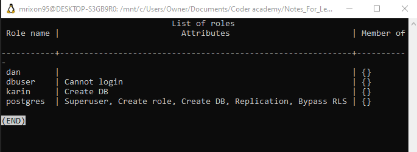

# Structured Query Language SQL

SQL is a language for defining, manipulating and controlling databases.


## Kahoot! Questions and Answers

Q1: A ___ is a collection of related reocrds or a collection of related tables

A1: Database

Q2: You can create/manage a single or multiuser database using a ____

A2: DBMS

Q3: A student, company, car, or plant are examples of ____.

A3: Entity

Q4: A name, address, and date of birth are examples of ____.

A4: Attributes

Q5: A 1-to-1, 1-to-Many, and Many-to-Many are examples of ____.

A5: Relationship

Q6: This ERD is ____.

A6: One-to-One

 

Q7: This ERD is ____.

A7: One-to-Many

 

Q8: This ERD is ____.

A8: Many-to-Many

 

Q9: What is Not True in this relationship?

A9: A student can have no course enrolments (Optional)

Q10: Which 1NF rule this table doesn't satisfy

A10: Must have atomic values in columns


## SQL Categories

1. DDL (Data Definition Language): Data definition commands are used to create a database, modify a database structure by creating, altering, or deleting objects in a database.

2. DML (Data Manipulation Language): Data manipulation commands are used to Insert data into a database table, update, or delete data.
3. DCL (Data Control Language): Data control include commands for securing a database by creating roles and assigining permissions.
DCL is all about security. Grant and revoke priviledges
4. TCL (Transactional Control Language): Transactional control used to manage database transactions such as saving or restoring transactions in a database.
Allows the rollback of transactions. Updates aren't in the database until commited.
5. DQL(Data Query Language): Data query mainly used for data retrieval.

SQL is a database language and like programming languages needs a system to run on. Many systems are available in the market such as Miscrosoft SQL, MYSQL, PostgreSQL, Oracle DB, DB2, and Microsoft Access. Some DBMSs are open-source free for individuals and businesses, other are not. The language is the same accross all DBMSs with a slight syntax changes. In this course, will use PostgreSQL which is a free open source database system. PostgreSQL supports major operating systems such as Windows, Linux, and MacOS.


## PSQL Utility

Postgres comes with a default role of postgres

### Launch psql utility or connect to sql server using:
```
    
	sudo apt-get --purge remove postgresql
	sudo apt-get -y install postgresql
	
	/* Connect to PostgreSQL using the postgres role */
	sudo -i -u postgres

	/* Access PostgreSQL using the psql */
	psql
   
```


### Useful SQL commands:

```
/* See all users */
\du

/* List of databases */
\l

/* List relations in a database */
\l


/* See all users */
\du

/* Clear */
\! clear


/* Connect to a database*/
\c template1


/* List schemas */
\dn


/* List of commands in history */
\s


/* List all possible commands */
\h

```


### Create a database, tables and roles

```


/* Create database*/
/* Convention is to uppercase all the sql commands and lowercase for the names of the database*/
CREATE DATABASE mydatabase;

/* We are using a bunch of sql commands and utility commands. SQL commands end with semi-colon*/
/* Connect to the database we created*/
\c mydatabase

/* Create patient table */
CREATE TABLE patient(
	id integer,
	firstname VARCHAR,
	lastname VARCHAR,
	suburb VARCHAR
);

/* Create person table */
CREATE TABLE Person(
	ID integer,
	LastName VARCHAR,
	FirstName VARCHAR,
	Age INTEGER,
	City VARCHAR
);

/* View the structure of a particular table */
\d Person


/* Create role dbuser - by default it cannot login */
create role dbuser

```

 


```

/* Create user with login ability */
create role dan LOGIN;


/* Restart postgresql */
sudo service postgresql restart


trust - anyone who can connect to the server is authorized to access the database
peer - use client's operating system user name as database user name to access it.
md5 - password-base authentication

the pg_hba.conf file is located at /etc/postgresql/12/main/pg_hba.conf


```


```

/* See connection info */
\conninfo


/* Connect to mydatabase as dan */
\c mydatabase dan

/* Cannot create database as dan since dan does not have permission to do so */
CREATE DATABASE databaseone

```

 


```

/* See connection info */
\conninfo


/* Connect to mydatabase as dan */
\c mydatabase dan

/* Cannot create database as dan since dan does not have permission to do so */
CREATE DATABASE databaseone

```


```
DROP TABLE person;
DROP TABLE patient;

/* Make sure you are out of the database  */
DROP DATABASE mydatabase;


DROP ROLE karim;
DROP ROLE dan. dbadmin, dbuser;

```


```

create role dbadmin LOGIN SUPERUSER PASSWORD 'password';


drop role karin;


ALTERE TABLE patient RENAME TO new_patient;
ALTER TABLE new_patient
ADD COLUMN patientcountry VARCHAR;

ALTER TABLE new_patient
DROP COLUMN patientcountry VARCHAR;

ALTER TABLE new_patient
RENAME COLUMN patientfname
TO patientgname;

\d new patient;


```


```
/* Get rid of all the data in a table */
TRUNCATE TABLE anytable;
DROP TABLE anytable;

INSERT INTO new_patient(patientid, patientgname, patientlname, patientsuburb)
VALUES (1, 'Jack', 'Darling', 'Ryde')

INSERT INTO new_patient
VALUES (5, 'Jim', 'Lancen', 'Sydney')

SELECT * FROM new_patient;

DELETE FROM new_patient
WHERE patientid = 1;

```


```
GRANT SELECT
ON new_patient
TO eric;

GRANT INSERT
ON new_patient
TO eric;

```

SQL CONSTRAINTS:
Data Types CONSTRAINT
PostgreSQL common data types:

Character:
VARCHAR(n): fixed length character, does not pad spaces
CHAR(n): fixed length character, pads spaces
TEXT: variable length or unlimited length character
Numeric:
Integer:
SMALLINT: 2-byte signed integer -> range from -32,768 to 32,767
INT: 4-byte integer -> range from -2,147,483,648 to 2,147,483,647
SERIAL: AUTOINCREMENT Integer
Floating Point:
NUMERIC(precision, scale):
Temporal:
DATE: dates only
TIME: time only
TIMESTAMP: date and time values
Boolean:
true: true, ‘1’, ‘t’, ‘y’, or ‘yes’
false: false, ‘0’, ‘f’, ‘n’, or ‘no’


```


CREATE TABLE MyDataTable (
    ID SERIAL,
    Name VARCHAR(5),
    Age SMALLINT,
    Address TEXT,
    Price NUMERIC(6,2),
    Birthdate DATE,
    Birthtime TIME,
    Birthdatetime TIMESTAMP,
    Owner BOOLEAN
);

```


Test the Data Type CONSTRAINT:

```
INSERT INTO MyDataTable (Name, Age, Address, Price, Birthdate, Birthtime, Birthdatetime, Owner)
VALUES('JamalDiab',32,'Burroway Road, SOP',232.416,'2016-06-22', '19:10:25-07', '2016-06-22 19:10:25-07', true);

```

Output:

ERROR: value too long for type character varying(5)

```
INSERT INTO MyDataTable (Name, Age, Address, Price, Birthdate, Birthtime, Birthdatetime, Owner)
VALUES('Jamal',32768,'Burroway Road, SOP',232.416,'2016-06-22', '19:10:25-07', '2016-06-22 19:10:25-07', false);
```


Output:

ERROR: smallint out of range

```
INSERT INTO MyDataTable (Name, Age, Address, Price, Birthdate, Birthtime, Birthdatetime, Owner)
VALUES('Jamal','Highway','Burroway Road, SOP',232.416,'2016-06-22', '19:10:25-07', '2016-06-22 19:10:25-07', 'no');
```
Output:

ERROR: smallinERROR: invalid input syntax for type smallint: “Highway”

```
INSERT INTO MyDataTable (Name, Age, Address, Price, Birthdate, Birthtime, Birthdatetime, Owner)
VALUES('Jamal',36,'Burroway Road, SOP',232456.416,'2016-06-22', '19:10:25-07', '2016-06-22 19:10:25-07', '1');
```
Output:

ERROR: numeric field overflow

```
INSERT INTO MyDataTable (Name, Age, Address, Price, Birthdate, Birthtime, Birthdatetime, Owner)
VALUES('Jamal',36,'Burroway Road, SOP',232.416,'2016-06', '19:10:25-07', '2016-06-22 19:10:25-07', '0');
```

Output:

ERROR: invalid input syntax for type date: “2016-06”

```
INSERT INTO MyDataTable (Name, Age, Address, Price, Birthdate, Birthtime, Birthdatetime, Owner)
VALUES('Jamal',36,'Burroway Road, SOP',232.416,'2016-06-22', '19', '2016-06-22 19:10:25-07', 'yes');
```

Output:

ERROR: invalid input syntax for type time: “19”

```
INSERT INTO MyDataTable (Name, Age, Address, Price, Birthdate, Birthtime, Birthdatetime, Owner)
VALUES('Jamal',36,'Burroway Road, SOP',232.416,'2016-06-22', '19:10:25-07', '19:10:25-07', 'y');
```

Output:

ERROR: invalid input syntax for type timestamp: “19:10:25-07”

```
INSERT INTO MyDataTable (Name, Age, Address, Price, Birthdate, Birthtime, Birthdatetime, Owner)
VALUES('Jamal',32,'Burroway Road, SOP',232.416,'2016-06-22', '19:10:25-07', '2016-06-22 19:10:25-07', 'n');
NOT NULL CONSTRAINT
CREATE Persons table with NOT NULL CONSTRAINT:
```

```
CREATE TABLE Persons (
    ID INTEGER NOT NULL,
    LastName VARCHAR,
    FirstName VARCHAR,
    Age INTEGER,
    City VARCHAR
);
Test the NOT NULL CONSTRAINT:
```

```
INSERT INTO Persons
VALUES(NULL,'Jamal','Diab',19,'Sydney');
```
Output:

ERROR: null value in column “id” violates not-null constraint

DETAIL: Failing row contains (null, Jamal, Diab, 19, Sydney).

UNIQUE CONSTRAINT
CREATE Persons table with UNIQUE CONSTRAINT:

```


```
CREATE TABLE Persons (
    ID INTEGER NOT NULL UNIQUE,
    LastName VARCHAR,
    FirstName VARCHAR,
    Age INTEGER,
    City VARCHAR
);
```

Test the UNIQUE CONSTRAINT:

```
INSERT INTO Persons
VALUES(12,'Jamal','D',19,'Sydney');
INSERT INTO Persons
VALUES(12,'Nick','C',23,'Sydney');
```

Output:

ERROR: duplicate key value violates unique constraint “persons_id_key”

DETAIL: Key (id)=(12) already exists.

PRIMARY KEY CONSTRAINT

```
CREATE Persons table with PK CONSTRAINT:

CREATE TABLE Persons (
    ID INTEGER PRIMARY KEY,
    LastName VARCHAR,
    FirstName VARCHAR,
    Age INTEGER,
    City VARCHAR
);
```

Test the PK CONSTRAINT:

```
INSERT INTO Persons
VALUES(12,'Jamal','D',19,'Sydney');
```

```
INSERT INTO Persons
VALUES(NULL,'Jamal','Diab',19,'Sydney');
```
Output:

ERROR: null value in column “id” violates not-null constraint

DETAIL: Failing row contains (null, Jamal, Diab, 19, Sydney).

INSERT INTO Persons
VALUES(12,'Nick','C',23,'Sydney');
Output:

ERROR: duplicate key value violates unique constraint “persons_pkey”

DETAIL: Key (id)=(12) already exists. _______

CHECK CONSTRAINT
CREATE Persons table with CHECK CONSTRAINT:

```
CREATE TABLE Persons (
    FirstName VARCHAR,
    Age INTEGER,
    City VARCHAR,
    CONSTRAINT AgeCheck CHECK (Age BETWEEN 18 AND 25),
    CONSTRAINT CityCheck CHECK (City='Sydney')
);

CREATE TABLE UserAccount(
    Username VARCHAR,
    Password VARCHAR,
    CONSTRAINT PassLenCheck CHECK (LENGTH(Password)>6)
);
```


Test the CHECK (AgeCheck) CONSTRAINT:

```
INSERT INTO Persons
VALUES('Mike',32,'Sydney');
```

Output:

ERROR: new row for relation “persons” violates check constraint “agecheck”

DETAIL: Failing row contains (Mike, 32, Sydney).

Test the CHECK (CityCheck) CONSTRAINT:

```
INSERT INTO Persons
VALUES('Dan',19,'Melbourne');
```

Output:

ERROR: new row for relation “persons” violates check constraint “citycheck”

DETAIL: Failing row contains (Dan, 19, Melbourne).

Test the CHECK (PassLenCheck) CONSTRAINT:

```
INSERT INTO UserAccount
VALUES ('Jamal','67jk7');
```

Output:

ERROR: new row for relation “useraccount” violates check constraint “passlencheck”

DETAIL: Failing row contains (Jamal, 67jk7).


